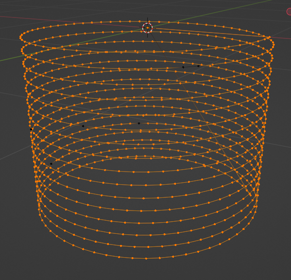
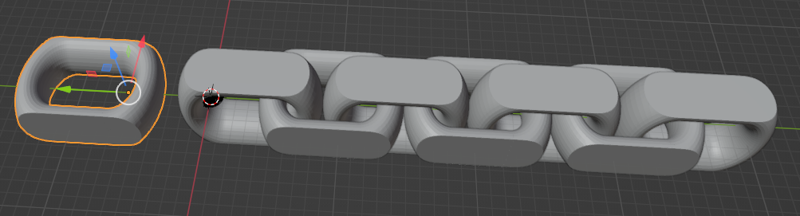
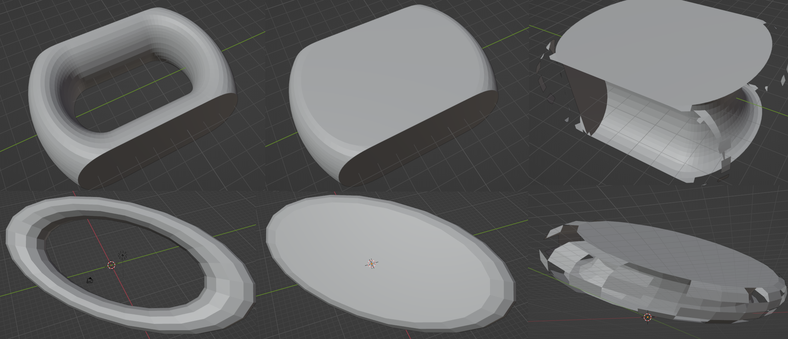
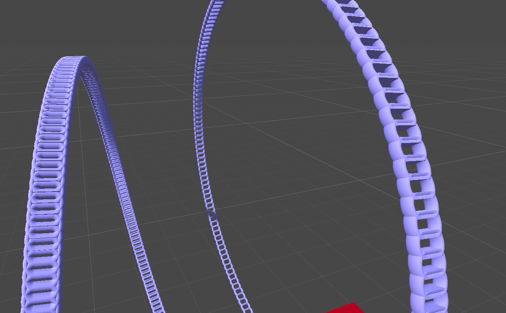

# Casting Chain

Developing a Chain Casting Tree in Go

# Steps

The following steps are what I think are necessary to develop this project:

## 1. Support Helix

Create a helix (spherical spiral) as demonstrated in ``main.go`` and saved in ``spiral.obj``. You see the helix saved in blender below:

Around each of the points along the helix, a circle must be created. Each circle will be connected to the next circle and triangulated to create a cylinder. Parameters that can be controlled here: 

* Sampling rate along the curve
* Height incrementation between each level
* Radius
* Thickness

## 2. Identifying Pieces

Each piece in the chain must be identified in order. This process includes:

* Separating each piece into its own mesh. This may be done by selecting one triangle and finding all of its neighbors. The code for this is already available. You can also do this in blender by going in edit mode, pressing "P" and clicking "selection by loose parts":

* Finding the order of the pieces can be done by finding the center point of each separated piece, then somehow finding the orders of those points (maybe form a doubly linked list of closest points?).

## 3. Shape Analysis

This part involves finding the gap inside the ring.

* Find the shape's convex hull using csg library
* You can substract the convex hull from the original shape to find the gap.

* Performance of csg doesnt seem good when using substract (?). Perhaps use coarse voxel grid.
* Objective is to find a voxelized shape of the ring and a voxelized shape of the gap.

## 4. Initial Placement

Objects must be placed along a helix that has a shape similar to the support helix, but with a vertical increment.
[This unity project repo](https://github.com/mogoson/MGS.Chain) contains the code to place objects along a curve with the correct rotation. Objects are facing the center of the curve as seen below:

## 5. Adjusting Placement

The **rotation** and **position along the curve** of the objects must be corrected.

* Every other object must have 90 degrees difference with the previous one.
  * But 90 degrees along what axis?
  * Does this mean shape analysis involves a step to find the longest axis?
* Object placement must be adjusted such that the end of one is completely contained in the hole of the next one.
  * Only move the objects along the curve.
  * This can be done in brute-force manner, but there is probably a mathematical way(?). This is probably the hardest step.
  * Objects can have more than one hole.

## 6. Intersection Tests

An optimizing step can include checking every object against the next one to see if an intersection is found. Slight adjustments can be made to fix these.

## 7. Support

Supports will be placed as such(?):

* 1. Find the center point for the first ring.
* 2. Raycast in vertical upwards direction. Find the corresponding point on the support helix.
* 3. Create support spanning from that point to the top of the ring.
* 4. Find center point for the next ring.
* 5. Repeat step 2-3 but raycast downwards instead.
* 6. Repeat 1-5 until every ring is covered.